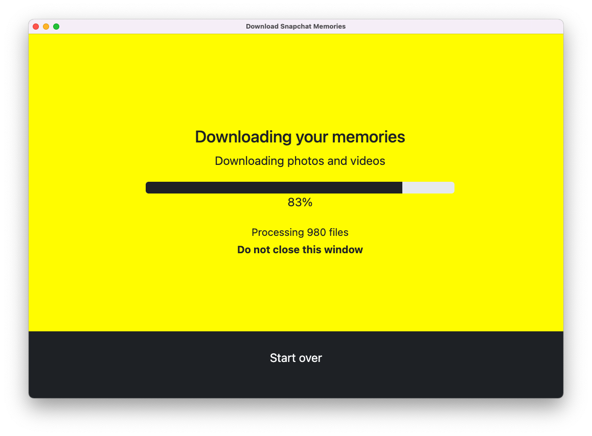

# Download Snapchat Memories

Want a copy of all of your Snapchat memories? You're in the right place!

This desktop application makes downloading all of your memories as simple as possible. The app downloads photos and videos in regular `jpg` and `mp4` formats.

### How to use

Download the application: [www.downloadmysnapchatmemories.com](http://www.downloadmysnapchatmemories.com).

Watch a video tutorial [here](https://youtu.be/0_1mJ3w5LaA).

Read a guide [here](https://www.christianlisle.io/post/download-snapchat-memories).

<div align="center">
  <a href="http://www.downloadmysnapchatmemories.com" title="Download Snapchat Memories" >
    
  </a>
</div>

If you want to use the app without complications, please follow [this tutorial](https://youtu.be/0_1mJ3w5LaA).

## App development 🤓

### Running the app in development mode

<!-- no toc -->

#### System requirements

1. [NodeJS](http://nodejs.org) (v17.1.0)
2. [npm](http://npmjs.com)
3. [nvm](http://nvm.sh/)

Once the repository is cloned on your computer, navigate to the repository folder, `memory-download`.

Ensure that you are using the correct version of `node` with `nvm`:

```bash
nvm use
```

Install the required node modules using `npm`:

```bash
npm i
```

Run the [electron](https://www.electronjs.org/) desktop application in development mode

```bash
npm run dev
```

An electron application will open in development mode. Follow the steps provided by the simple user-interface to download your Snapchat memories.

### Contributing

See [contributing.md](/contributing.md) for information regarding contributions.
